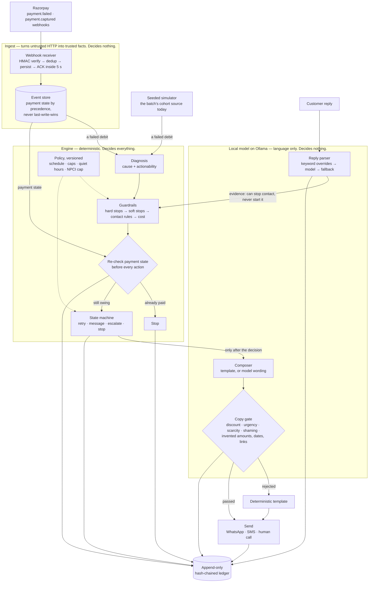
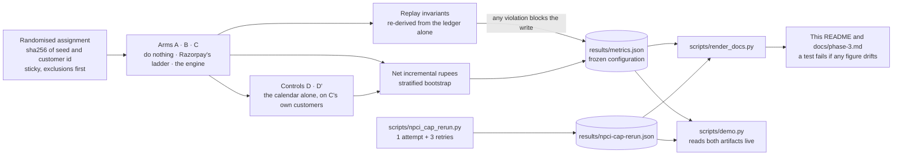

# AI Revenue Recovery — failed recurring collections

**Razorpay AI Buildathon, Track 03.**

A decisioning layer for failed recurring collections on UPI AutoPay and eMandate mandates: who
to contact, when, on which channel, and whom to leave alone. A deterministic state machine makes
every decision; a local language model only writes the words and reads the replies. It is
measured against a randomised holdout and against Razorpay's documented retry ladder, on a
simulated cohort — the reason for that comes before any number, [below](#read-this-before-the-number).

We then measured the controls that tell you whether the decisioning is doing the work — twice,
under two sets of rules, and the two answers disagree:

- **With six retries**, the frozen configuration the headline is computed under, it is not. A
  retry loop with no diagnosis, no messages and no model does most of the recovering.
  **The money is in the calendar; the engine is what lets you take it lawfully.**
- **Inside NPCI's attempt cap** — one attempt and three retries per mandate cycle, the rule a
  real deployment would ship under — the retries run out, and the decisioning layer's
  contribution becomes measurably positive. Scarcity of attempts is what makes deciding *whom*
  to contact worth money.

Both are published, with their intervals, because the disagreement is the finding.

## The problem

Recurring collection in India succeeds between 30% and 50% of the time. On Razorpay
Subscriptions, a failed charge is retried on each of the following three days — four debits in
all — and then the subscription halts. The documentation is candid about what happens next:

> you will have to charge them manually.

A merchant debiting saved tokens directly through the recurring-payments API gets no automatic
retry at all; the documentation says to retry the debit manually. Either way, a failed debit is
three losses for the merchant: the revenue, the customer — who did not choose to leave — and
the effort of collecting by hand.

Four attempts across four days is the whole strategy. A monthly salary cycle is thirty days
long, so a customer whose pay lands on day nine is retried entirely during the week they had
no money, then written off. Nothing in that ladder asks *why* the payment failed: a card that
expired three months ago is retried on exactly the same schedule as an account that was
briefly short.

## What this does

It sits above that ladder and decides. A deterministic state machine reads the failure cause,
checks a set of guardrails, and picks an action — retry silently, send a message, escalate to
a human, or stop. Every decision is written to an append-only, hash-chained ledger that can be
replayed afterwards under the policy version that applied at the time.

Two things it does that the recovery number alone does not capture, and that no retry loop can
do: it replaces dead instruments by asking for a new one, which a silent retry can never
achieve and which the control section below counts from the artifact; and it stops — on
payment, on opt-out, on dispute — and pauses on bereavement, which a retry loop never does
because it never speaks and so never hears an objection.

A local language model writes the wording and reads inbound replies. **It never decides
whether to contact anyone about money.**

## Watch it run

```bash
python scripts/demo.py           # deterministic; no model, no credentials, no network
python scripts/demo.py --live    # ask the local model for real wording
python scripts/demo.py --pause   # step through scene by scene
python scripts/demo.py --ask     # type a customer reply and watch the engine decide
```

It opens on a **real Razorpay event** — the `payment.failed` their servers sent to a laptop
through a zrok tunnel during phase 0 — put back through the shipped webhook receiver, which
verifies it, ignores the redelivery, and rejects the same body with one byte changed. Their own
`error_reason` on that payload is `payment_failed`, which says nothing, and watching the
taxonomy file it under `other` is the clearest statement of the problem this repo exists for.

Then one failed collection end to end on the simulated cohort: the diagnosis that error code
alone cannot give you, the guardrails firing, the ladder escalating, the message being composed,
the copy gate rejecting non-compliant wording, replies parsed into a promise-to-pay and an
opt-out, the five replies that break naive parsers — two of them not in English — a late
`payment.captured` arriving as a webhook and stopping the engine mid-ladder, the hash-chained
ledger replayed in order, the measured result read live from `results/metrics.json` so the
screen cannot drift from the artifact, and then the same cohort re-run **inside NPCI's attempt
cap** — one attempt and three retries per mandate cycle, from
[`results/npci-cap-rerun.json`](results/npci-cap-rerun.json). The frozen headline is measured
on six attempts, which is over that cap; rather than argue the point, the repo measures both
and the two artifacts disagree in an interesting way. See
[`scripts/npci_cap_rerun.py`](scripts/npci_cap_rerun.py) for what changes and what is still
not modelled.

Every component in it is imported from `src/recovery/` exactly as the batch imports them —
nothing is re-implemented for the demo, because a demo that re-implements the system is a demo
of the demo. The copy-gate probes each declare the rule they are meant to trip, and the run
prints whether the gate agreed; a test fails the build if they ever disagree.

---

## Read this before the number

**The cohort is simulated, and that is a real limitation rather than a disclaimer.**
Subscriptions is gated on this Razorpay test account: `/v1/plans` and `/v1/subscriptions`
return 401 while ten other endpoints return 200 with the same key. Without it there is no
`auth_attempts` counter, no observable retry ladder, and no way to make a live charge fail on
demand. So the failed-charge cohort is **generated by a seeded simulator**, and the incumbent
ladder is **reimplemented from documentation rather than observed**.

Randomisation removes selection bias *within* the simulation. It cannot validate the
simulation. Every figure below is a statement about a model we wrote, and the full list of
what that costs is in [Limitations](#limitations) — which is worth reading before the table,
not after.

The evidence for the gating, and the support ticket raised against it, are in
[`docs/phase-0-findings.md`](docs/phase-0-findings.md).

## What it recovered

Measured against a randomised holdout, net of contact cost, under a metric frozen *before any
engine code existed* — git ancestry proves the order, and a test checks the ancestry rather
than asserting it.

<!-- generated:readme-headline -->
| | |
|---|---|
| **Net incremental recovery** | **Rs 957,156** |
| 95% CI | Rs 807,479 – Rs 1,094,821 |
| Per treated customer | Rs 342.09 |
| Compared against | engine (C) vs Razorpay's T+0..T+3 ladder (B) |
| Cost per incremental rupee | Rs 0.0026 |
| Recovery rate, A / B / C | 2.00% / 25.25% / 67.41% |
| Cohort | 5,000 simulated customers, seed 20260905 |
| Interval method | percentile, stratified by arm, 10,000 resamples |
| Metric frozen at | `8d14dbe`, ancestry verified: true |

All three pre-registered readouts, not just the largest. The 21-day window is the primary; the
other two were declared in the frozen definition before any result existed and are reported
whatever they say:

| Readout | Net incremental | 95% CI |
|---|---|---|
| **21-day (primary)** | **Rs 957,156** | Rs 807,479 – Rs 1,094,821 |
| 14-day (secondary) | Rs 491,301 | Rs 348,590 – Rs 625,406 |
| Shifted-parameter cohort | Rs 424,913 | Rs 276,849 – Rs 568,238 |

Arm A does nothing. Arm B is Razorpay's own T+0..T+3 ladder, reimplemented. Arm C is the
engine. The headline is **C against B** - beating do-nothing proves nothing, since every
recovery vendor beats doing nothing. All three intervals exclude zero.
<!-- /generated:readme-headline -->

### Inside NPCI's attempt cap

The configuration above takes six attempts per failed debit. NPCI's UPI circular OC-215-A
allows one attempt and three retries per mandate execution, so the frozen headline is measured
outside the rule a deployment would have to ship under. The same cohort was therefore re-run
inside the cap: three retries spread across the same horizon, no same-day re-debit, Razorpay's
ladder on its documented T+1..T+3, every debt scored on its own 21-day window, and self-cure
counted identically in every arm.

It is a separate artifact — [`results/npci-cap-rerun.json`](results/npci-cap-rerun.json), from
[`scripts/npci_cap_rerun.py`](scripts/npci_cap_rerun.py) — reported beside the headline rather
than instead of it. The frozen definition fixes the configuration the headline is computed
under, and re-running a pre-registered measurement under new rules and keeping the better story
is precisely what a freeze exists to prevent. The cap is a policy field (`Policy.retry_days`),
not a patch applied from a script, so the configuration measured is one the engine ships with.

<!-- generated:readme-npci -->
| Inside the cap | |
|---|---|
| **Net incremental recovery, C vs B** | **Rs 724,503** |
| 95% CI | Rs 578,218 – Rs 862,865 |
| Per treated customer | Rs 258.94 |
| Recovery rate, B / D' / C | 25.25% / 51.47% / 58.40% |
| The calendar alone, D' vs B | Rs 565,624 (Rs 424,405 – Rs 698,579) |
| Cost per incremental rupee | Rs 0.0042 |
| Rule | NPCI UPI circular OC-215-A: 1 attempt + 3 retries per mandate per cycle |
| Schedule | the charge on day 0, retries on days 7, 14, 21; Razorpay's ladder on days 1, 2, 3 |
| Window | 21 days, anchored on each debt's own failure date |
| Generated at | `1e085e5`, clean tree |

**What the decisioning layer is worth inside the cap (C vs D'): Rs 158,880**, 95% CI Rs 111,611
– Rs 207,760, which excludes zero. With six retries the same comparison is Rs -101,326 on an
interval that crosses zero. Read together, the two artifacts make one finding: when attempts
are plentiful the calendar does the work, and when the rule makes them scarce, deciding whom to
contact is what is left to collect with.

Still not modelled, and each of these would move the figures above:

- Peak hours. OC-215-A confines retries to non-peak windows; every action here is timed at
  10:00, inside the 10:00-13:00 peak. The simulator has no time-of-day effect, so this
  changes none of the figures above and all of the deployment.
- Pre-debit notification under the RBI e-mandate framework.
- eMandate confirmation lag: charges settle synchronously here.
- Every simulator limitation in src/recovery/cohort/PARAMETERS.md, inherited unchanged. These
  intervals are sampling noise in a model we wrote.
<!-- /generated:readme-npci -->

## Where the money actually comes from

The headline compares the engine against Razorpay's ladder, and those two differ in **two**
ways at once: the retry calendar *and* the whole decisioning layer. So that comparison alone
cannot say which of them produced the recovery. Arm D holds the calendar fixed and strips
everything else away, which separates them.

<!-- generated:readme-control -->
| Arm | What it does | Recovery |
|---|---|---|
| A | nothing at all | 2.00% |
| B | Razorpay's ladder, days 0,1,2,3 | 25.25% |
| D | the calendar alone, retrying every cause | 80.38% |
| **D'** | **the calendar alone, respecting the diagnosis** | **71.05%** |
| C | the full engine | 67.41% |

**Better timing is worth Rs 1,260,370 (+55.13 pp).** That is the finding. Razorpay's ladder
does not fail because it is unintelligent; it fails because four attempts inside four days sit
in one broke week of a monthly salary cycle. A retry loop with no diagnosis, no message, no
guardrails and no model beats it by more than the entire engine does.

**Against that, the decisioning layer measures Rs -101,326 (-3.64 pp), on an interval of Rs
-224,204 to Rs 21,340 that CROSSES ZERO.** Published with its interval rather than as a signed
headline, because the point estimate on its own would claim a direction this run cannot
support. The defensible reading is that against a calendar which ignores opt-outs, decisioning
does not move recovery measurably - it changes what you are allowed to do while collecting,
which is the thing the control was built to isolate and cannot price. Use D' rather than D for
this comparison: the blind control also recovers causes that in reality need the customer to
act, which the simulator lets a silent retry fix. That is the same gap amendment A2 declined to
exploit for the engine, and using it against the engine would just be an inconsistent standard.
It is worth Rs 201,889 of the difference between the two comparisons.

**So why not ship D'?** Because it is not a product. It never replaces a dead instrument, which
only a message can do: the 277 debts diagnosed `needs_new_instrument` are ones D' declines to
retry at all, and the engine recovers 100 of them - a count read from the artifact, because the
previous sentence carried a hand-typed one that had been stale since amendment A10. It has no
answer to an opt-out, a dispute or a bereavement, because it never speaks and so never hears
one. And it cannot tell a card that expired in March from an account that was briefly short, so
it burns attempts on instruments that can never be charged.

The engine exists to make aggressive timing **safe to deploy**. The calendar is the lever;
compliance is the constraint on pulling it. Those two sentences are the submission, and the
controls above are what let us say them with a number rather than an assertion.

**All of the above is measured with six retries.** Inside NPCI's attempt cap the same
comparison is Rs 158,880 (Rs 111,611 – Rs 207,760), which excludes zero - see *Inside NPCI's
attempt cap* above. The calendar remains the lever; how much the decisioning adds depends on
how many pulls of it the rules allow.
<!-- /generated:readme-control -->

## What it failed to recover

A recovery system that reports only its wins is a marketing asset, not an engineering one.

<!-- generated:readme-failures -->
The engine did not recover 912 of 2,798 debts (32.59%), leaving Rs 722,838 on the table. That
total is four different things, and only one of them is a defect:

| Why it was not recovered | Customers | Rupees |
|---|---|---|
| Stopped by a guardrail — **the system was right to stop** | 183 | Rs 164,217 |
| No money in the window at all — **unreachable by any policy** | 267 | Rs 200,233 |
| Funded, but never attempted — **a defect; must stay 0** | 0 | Rs 0 |
| Attempted while funded, still unpaid — the honest residual | 462 | Rs 358,388 |

Recovering the first two rows would mean either breaking the opt-out, dispute and hardship
rules, or collecting from people who had no money at any point in the window. They are reported
as outcomes, not as failures to fix.
<!-- /generated:readme-failures -->

## How it is built

### The decision loop



**Read it in one direction.** The arrow into the model box leaves *after* the decision has been
made, and nothing returns into the state machine carrying an action. A parsed reply re-enters
the engine as **evidence** for the guardrails, and the evidence is asymmetric: it can stop
contact, and it can never start contact, lift a stop, or supply a date.

### Components

| Layer | Module | What it does | The decision that shaped it |
|---|---|---|---|
| Ingest | `ingest/webhook.py` | Verifies the HMAC signature, deduplicates event ids, persists payment state, acknowledges inside Razorpay's five-second budget | Dedup runs *after* verification, so an unsigned caller cannot poison it; a late `failed` never overwrites a `captured` |
| Source | `cohort/source.py`, `cohort/simulator.py` | Supplies failed debits behind one interface; today a seeded simulator | Subscriptions is gated on the test account, and the interface lets a real source replace the simulator without touching anything above it |
| Diagnosis | `diagnosis/taxonomy.py` | Cause and actionability from the composite error key | `error_code` alone has three values; the reason, source and step carry the signal |
| Engine | `engine/machine.py` | Plans each debt's day, records replies and outcomes, latches absolute stops | Payment state is re-read before each action, and every read that changes the answer is logged |
| Guardrails | `engine/guardrails.py` | Hard stops → soft stops → contact rules → cost | The order is load-bearing: a statutory stop is never recorded as a cost decision (amendment A8) |
| Policy | `engine/policy.py` | Frozen and versioned: retry schedule, caps, quiet hours, escalation ladder, costs, the NPCI cap | A regulator's rule is a policy field, not a code path |
| Language | `llm/composer.py` | Message wording from a local model, or a deterministic template | The payment link is inserted by code; the model never writes it |
| Language | `llm/copy_gate.py` | Rejects discounts, urgency, scarcity, shaming, and invented amounts, dates and links | The send path fails closed |
| Language | `llm/parser.py` | Reply intent: keyword overrides, then the model, then a fallback; dates by a pure function | The model may stop contact and never start it; the keyword floor is bilingual |
| Audit | `ledger/audit.py` | An append-only, hash-chained record of every decision, action, reply and state read | It records what the engine declined to do and why, not only what it did |
| Evaluation | `evaluation/` | Randomised assignment, the arms and controls, the metrics, replay invariants | The invariants never import the engine, and any violation blocks publishing |

### How a number reaches this page



### The commitments, and where each is enforced

**A deterministic state machine owns every decision.** The model composes wording and parses
replies; it decides nothing about whether anyone is contacted about money.

The split is structural rather than conventional, and stated exactly: the engine imports two
names from `llm/parser` — `Intent`, an enum, and `ParsedReply`, a frozen dataclass. Both are
vocabulary for describing a reply that has *already* been parsed. It imports no function that
reaches a model, and nothing under `engine/` performs an HTTP call. So there is no call path
from a decision to a language model, which is the property that matters and is narrower than
"no import at all". A test enumerates the permitted names and fails if the engine ever
imports one that can invoke something.

**The copy gate is demonstrated, not asserted.** Generated wording is rejected if it
introduces a discount, urgency, scarcity, or shaming. This is not a tone preference. Under
TRAI's mixed-content rule such wording converts a service message into a promotional one and
inherits consent, DND and time-band obligations; fabricated urgency and repeated nudging are
two named patterns in the CCPA Dark Patterns Guidelines 2023. The gate is tested against a
real rejection from a real model.

**The model may stop contact; it may never start it.** Opt-out, dispute and hardship are
matched by code first, in that order — a stop that never expires outranks a pause that does.
The keyword list is bilingual, because customers reply in romanised Hinglish as often as in
English. Where the list is silent and the model reports an opt-out or a dispute, that is
honoured as a stop and recorded as `llm_stop`; no model output can lift a stop, begin contact,
or supply a date. The asymmetry is the compliance rule and the prompt-injection defence at once:
the most a hostile reply can achieve is to stop contact with its own sender.

**Payment state is re-checked immediately before every action.** Razorpay's webhooks are
at-least-once and unordered — `payment.failed` can arrive after `payment.captured` for the
same transaction. Without the re-check, the system duns people who have already paid. In the
batch the state is the simulator's ground truth; in the demo it is the event store the webhook
receiver writes, so a late `payment.captured` stops the engine mid-ladder on screen.

**Stopping rules are enforced in code and logged**: contact caps, quiet hours, silence during a
promise-to-pay (silent retries continue), stop on dispute, on opt-out, on payment received.
Contact is confined to 08:00–19:00 IST as a product invariant. The design lets a tenant narrow
these rules and never widen them; that constraint is documented rather than yet validated in
code — see [Known issues](#known-issues-found-after-submission).

**The audit ledger is hash-chained and replayable**, and the invariant checks that validate a
run never import the engine — they re-derive violations from the records alone. If any
invariant is non-zero the batch **refuses to write** `results/metrics.json` at all, on the
grounds that a number from a run which broke its own stopping rules is worse than no number.

## Reproducing the result

<!-- generated:readme-reproduce -->
```bash
pip install -e '.[dev]'                 # Python >= 3.11; no runtime dependencies
python scripts/run_batch.py             # regenerates results/metrics.json (~18 min)
python scripts/npci_cap_rerun.py        # regenerates results/npci-cap-rerun.json
python scripts/render_docs.py --check   # fails if any figure in the docs drifted
pytest                                  # the full suite
```

The batch is offline and deterministic: no Razorpay credentials, no network, and no Ollama. It
regenerates `results/metrics.json` byte-for-byte from seed 20260905 on 5,000 customers, with
the sole exception of `head_commit`, which records the commit it was generated at. The local
model is exercised in the test suite and the demo, where wording is the point; it cannot affect
this measurement, and `docs/metric-definition.md` says so.
<!-- /generated:readme-reproduce -->

Every figure in this README and in `docs/phase-3.md` is generated by `scripts/render_docs.py`
— from `results/metrics.json`, and for the capped run from `results/npci-cap-rerun.json`. None
is typed. A test runs the renderer in `--check` mode, so a document that disagrees with an
artifact fails the build rather than waiting for a reader to notice.

## Limitations

<!-- generated:readme-limitations -->
1. Outcomes are simulated: Subscriptions is gated on this Razorpay test account
   (docs/phase-0-findings.md), so the failed-charge cohort is generated, not observed.
   Randomisation removes selection bias WITHIN the simulation; it cannot validate the
   simulation.

2. Significance is cheap here - N is a free parameter on a simulator. The CIs express precision
   inside the simulation only, not evidence about the real world.

3. We wrote the response model. Its parameters trace to cited public figures
   (src/recovery/cohort/PARAMETERS.md), the engine never sees them, and evaluation runs on
   shifted parameters - that reduces the problem, it does not eliminate it.

4. Contact costs are published list prices, not invoices, taken at the expensive end of each
   range. The WhatsApp rate could not be read at source.

5. MDR is excluded: it scales incremental recovery by (1 - mdr) and cannot change its sign or
   the ranking of arms.

6. Customer annoyance is unpriced, deliberately - no defensible number could be sourced, so it
   is handled as hard constraints rather than a tradeable term.

7. The incumbent baseline is reimplemented from Razorpay's documentation, not observed: gate
   0.3 was voided when Subscriptions turned out to be gated.

8. In-batch composition uses deterministic templates. The simulator has no notion of wording,
   so the LLM cannot affect this measurement; it is exercised live in the test suite and
   results/phase2/.

9. The weakest subgroup is needs_customer_action, and it was deliberately NOT fixed. The engine
   never silently retries it, while it does retry a dead instrument once a contact has gone
   out. Making those symmetric is a one-line change that would raise the headline - but the
   simulator gates the instrument case on a flag only a contact can set and gates this case on
   nothing, so the gain would measure a modelling gap rather than recovered money. Repairing
   that gap instead would strip recovery from the incumbent baseline, which retries blindly and
   contacts nobody. Both were declined; see amendment A2.

10. The pre-registered prediction for this phase did not hold. The plan said a randomised
    holdout would produce a SMALLER lift than the un-held-out Phase 2 sanity run; the measured
    lift is larger. The cause is identified rather than guessed - both the sanity run and the
    first Phase 3 run were measuring an engine whose retry schedule stopped six days short of
    its declared 21-day horizon (amendment A1). The prediction is left unedited in
    docs/phase-3.md, because a pre-registration revised after the result is not a
    pre-registration.
<!-- /generated:readme-limitations -->

## Known issues, found after submission

An adversarial audit of this repository, run after submission, found the following. The fixed
items are fixed with tests, and arm C replayed on the old and the new code gives identical
outcomes and an identical ledger — so none of the fixes moved `results/metrics.json`. The open
items are listed so that nobody has to find them.

**Fixed**

- A bereaved customer who also wrote "stop messaging me" was classified as hardship: a seven-day
  pause, after which contact resumed. Opt-out and dispute now outrank hardship.
- An opt-out the model detected, but no keyword matched, was discarded. It is now honoured as a
  stop.
- Romanised Hinglish opt-outs and promises ("mat bhejo", "kal pay karunga") were not read
  without a model. They are now.
- "Please don't stop my subscription, I will pay" was read as an opt-out, and "who is this?" as a
  permanent dispute. Negated stops are scrubbed before matching; an identity question is no
  longer a dispute.
- A hardship callback was scheduled from any number in the reply, so "died 2 days ago" set a
  callback for the following day. Dates now come only from a callback clause.
- Payment state was re-read once per debt per day rather than before each action. It is now
  read per action.
- A hand-typed count sat inside a generated block, where `--check` could never see it drift. It
  is generated now.
- The frozen schedule exceeds NPCI's attempt cap. The capped measurement now exists, above.

**Open**

- **Window anchoring in the main batch.** Every arm's 21-day window starts on the cohort start
  date rather than on each debt's own failure date, so the engine loses its final retry on
  debts that failed later, and the baselines can retry a debt before it has failed. Re-anchoring
  moves both the headline and the six-retry decisioning comparison, and has not yet been re-run
  in the main batch. The capped artifact is anchored per debt.
- **Arm B re-debits on the day of the failure** in the main batch — five debits rather than the
  documented four. The capped artifact uses the documented T+1..T+3.
- **No per-debt reconciliation.** A pay-link payment and a mandate retry could both succeed:
  payment state is keyed by payment rather than by debt, and nothing locks a debit in flight.
- **Unsourced simulator mechanics.** The funds window, contact attention and fatigue, promise
  keeping and the reply mix are assumptions rather than cited figures, despite the opening line
  of `PARAMETERS.md`. Mandate type is assigned at random and never read, so `card_expired` can
  land on a UPI mandate.
- **Rules that never bind in the batch.** The payment re-check never fires there, because the
  harness stops planning a settled debt; the contact caps and quiet hours never bind either,
  because every action runs at 10:00 and the ladder has three rungs. Those zero counts are true
  by construction rather than evidence.
- **Not modelled:** DLT content templates and WhatsApp template approval (messages are free
  text), peak-hour timing, pre-debit notice, and eMandate confirmation lag.
- **Policy hygiene:** a promise-to-pay silences messages with no upper bound; the quiet-hours
  check assumes IST input; tenant overrides are not validated to narrow only; and the policy
  version is set by hand rather than derived from the policy's contents.
- **Provenance:** the committed `results/metrics.json` was generated with uncommitted changes on
  top of the commit it names, and ledger chain heads differ between runs because event ids are
  random. The contents regenerate identically; the hashes do not.
- **No human queue.** A dispute stops contact, and nothing routes it to a person.

## Compliance posture, stated precisely

- **Not** "DPDP-compliant". The substantive obligations of the Digital Personal Data
  Protection Act commence **14 May 2027**. The honest claim is that this is *designed for*
  that date from day one.
- The contact-frequency cap is a **labelled policy choice**, not a regulatory number. RBI's
  guidance says only that recovery agents must not "excessively" call; it names no figure. The
  seven-in-seven-days rule is US Regulation F and has no force in India.
- Quiet hours bind RBI-regulated entities rather than plain merchants. They are enforced here
  regardless, because it is the de-facto standard and makes the product sellable to a lender
  unchanged.

## Repository map

| Path | What is in it |
|---|---|
| `src/recovery/models.py` | The shared vocabulary: debts, customers, failures, decisions, actions, stop reasons |
| `src/recovery/ingest/` | Webhook receiver and event store: verify, deduplicate, persist payment state by precedence |
| `src/recovery/cohort/` | The source interface, the seeded simulator, and `PARAMETERS.md` |
| `src/recovery/diagnosis/` | Failure-cause taxonomy; classifies on cause *and* source, never on error code alone |
| `src/recovery/engine/` | Policy, guardrails, and the state machine that decides |
| `src/recovery/llm/` | Composer, reply parser, and the copy gate |
| `src/recovery/ledger/` | Append-only hash-chained audit trail |
| `src/recovery/evaluation/` | Assignment, arms and controls, metrics, the batch, replay invariants |
| `scripts/demo.py` | The narrated end-to-end demo: `--live`, `--pause`, `--ask` |
| `scripts/run_batch.py` | Runs the randomised experiment and writes `results/metrics.json` |
| `scripts/npci_cap_rerun.py` | Re-runs the cohort inside NPCI's attempt cap and writes `results/npci-cap-rerun.json` |
| `scripts/render_docs.py` | Renders every figure in the docs from the artifacts; `--check` fails on drift |
| `scripts/preflight.py` | Pre-publish sweep for keys, phone numbers, hostnames and forbidden claims |
| `scripts/ledger_extract.py` | A small, committable extract of the batch ledger |
| `scripts/phase2_evidence.py` | Regenerates the Phase 2 evidence from live model runs |
| `scripts/gate_0_7_power.py` | The sample-size check behind the metric definition |
| `scripts/create_payment_link.py`, `capture_payment_evidence.py`, `diagnose_webhook_secret.py` | Phase 0 tooling against the Razorpay test API |
| `scripts/webhook_daemon.ps1` and siblings | Phase 0: keeping the webhook receiver alive behind the zrok tunnel |
| `evals/model_bakeoff.py` | The model comparison that fixed where the language model is, and is not, trusted |
| `spikes/` | The first webhook receiver, kept as the record of what was promoted into `ingest/` |
| `results/metrics.json` | The frozen-configuration artifact every headline figure is generated from |
| `results/npci-cap-rerun.json` | The same cohort, measured inside NPCI's attempt cap |
| `results/phase0/` to `results/phase3/` | Evidence per phase: API probes, the real Razorpay webhook, the model bake-off, ledger extracts |
| `docs/metric-definition.md` | The frozen metric, and every amendment to it |
| `docs/compliance-india.md` | The regulatory reading behind every guardrail |
| `docs/razorpay-api-notes.md`, `docs/phase-0-findings.md` | What the Razorpay API does, and what it would not do on this account |
| `docs/support-ticket-draft.md` | The Subscriptions activation request raised against the gating |
| `docs/phase-0.md` to `docs/phase-4.md` | The build log, phase by phase |
| `docs/local-setup.md`, `docs/pr-review-archive.md` | Running it locally, and the external reviews it answered |
| `tests/` | The suite: engine, guardrails, parser, ledger, the frozen-metric ancestry, and the README's honesty rules |
