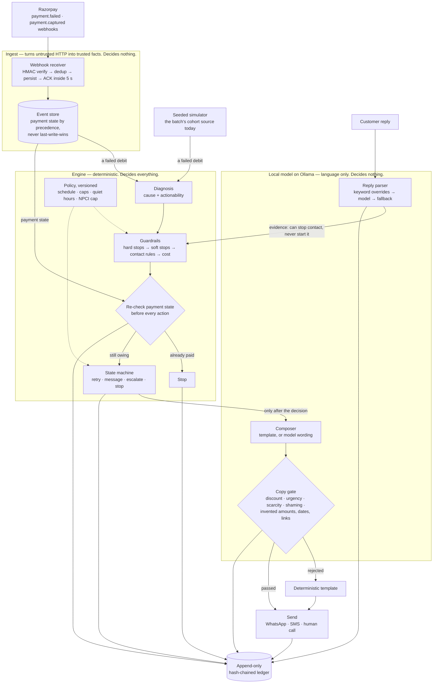
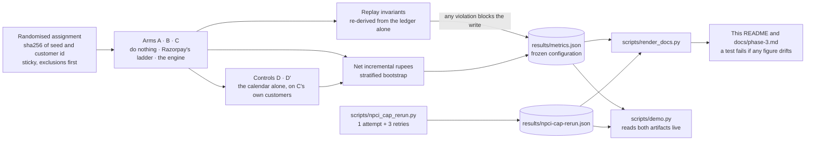

# AI Revenue Recovery — failed recurring collections

**Razorpay AI Buildathon, Track 03.**

A decisioning layer for failed recurring collections on UPI AutoPay and eMandate mandates: who
to contact, when, on which channel, and whom to leave alone. A deterministic state machine makes
every decision; a local language model only writes the words and reads the replies.

It is measured on a seeded, simulated cohort — [the reason comes before any
number](#read-this-before-the-number) — against a randomised holdout and against Razorpay's
documented retry ladder, **inside NPCI's attempt cap**: one attempt and three retries per
mandate cycle, the rule any real deployment ships under. Three findings, each with its figures
and interval below:

- **Timing is the lever.** The same three retries, moved off the broke week in which the charge
  failed and spread across the salary cycle, recover far more than Razorpay's consecutive-day
  ladder — with no diagnosis, no message and no model.
- **Decisioning is what the lever cannot reach.** With only three retries the calendar runs out
  of attempts. Replacing dead instruments, honouring promises and choosing whom to contact add
  a measurable amount on top of the calendar.
- **It stops when it should.** Payment, opt-out and dispute end contact; bereavement pauses it.
  The rules are code, the model may stop contact but never start it, and every decision is in a
  hash-chained ledger.

The pre-registered configuration — six retries, over NPCI's cap — is kept, unedited, in
[its own section](#the-pre-registered-measurement-six-retries). With that many attempts the
calendar alone does nearly all the work, and the disagreement between the two runs is part of
the finding.

## The problem

Recurring collection in India succeeds between 30% and 50% of the time. On Razorpay
Subscriptions, a failed charge is retried on each of the following three days — four debits in
all — and then the subscription halts. The documentation is candid about what happens next:

> you will have to charge them manually.

A merchant debiting saved tokens directly through the recurring-payments API gets no automatic
retry at all; the documentation says to retry the debit manually. Either way, a failed debit is
three losses for the merchant: the revenue, the customer — who did not choose to leave — and
the effort of collecting by hand.

Four attempts across four days is the whole strategy. A monthly salary cycle is thirty days
long, so a customer whose pay lands on day nine is retried entirely during the week they had
no money, then written off. Nothing in that ladder asks *why* the payment failed: a card that
expired three months ago is retried on exactly the same schedule as an account that was
briefly short.

## What this does

It sits above that ladder and decides. A deterministic state machine reads the failure cause,
checks a set of guardrails, and picks an action — retry silently, send a message, escalate to
a human, or stop. Every decision is written to an append-only, hash-chained ledger that can be
replayed afterwards under the policy version that applied at the time.

Two things it does that no retry loop can: it replaces dead instruments by asking for a new
one, which a silent retry can never achieve; and it stops — on payment, on opt-out, on dispute
— and pauses on bereavement, which a retry loop never does because it never speaks and so never
hears an objection.

A local language model writes the wording and reads inbound replies. **It never decides
whether to contact anyone about money.**

## Watch it run

```bash
python scripts/demo.py --live --pause --ask   # the full demo, stepped, with the keyboard handed over
python scripts/demo.py                        # deterministic; no model, no credentials, no network
```

It opens on a **real Razorpay event** — the `payment.failed` their servers sent to a laptop
through a zrok tunnel during phase 0 — put back through the shipped webhook receiver, which
verifies it, ignores the redelivery, and rejects the same body with one byte changed. Their own
`error_reason` on that payload is `payment_failed`, which says nothing, and watching the
taxonomy file it under `other` is the clearest statement of the problem this repo exists for.

Then one failed collection end to end on the simulated cohort: the diagnosis that error code
alone cannot give you, the guardrails firing, the ladder escalating, the message being composed,
the copy gate rejecting non-compliant wording, replies parsed into a promise-to-pay and an
opt-out, the five replies that break naive parsers — two of them not in English — a late
`payment.captured` arriving as a webhook and stopping the engine mid-ladder, and the
hash-chained ledger replayed in order. It ends on the measured results, the pre-registered run
and the capped headline, both read live from their artifacts so the screen cannot drift from
them. With `--ask`, whoever is watching types a customer's reply and sees what the engine does
next.

Every component in it is imported from `src/recovery/` exactly as the batch imports them —
nothing is re-implemented for the demo, because a demo that re-implements the system is a demo
of the demo. The copy-gate probes each declare the rule they are meant to trip, and the run
prints whether the gate agreed; a test fails the build if they ever disagree.

---

## Read this before the number

**The cohort is simulated, and that is a real limitation rather than a disclaimer.**
Subscriptions is gated on this Razorpay test account: `/v1/plans` and `/v1/subscriptions`
return 401 while ten other endpoints return 200 with the same key. Without it there is no
`auth_attempts` counter, no observable retry ladder, and no way to make a live charge fail on
demand. So the failed-charge cohort is **generated by a seeded simulator**, and the incumbent
ladder is **reimplemented from documentation rather than observed**.

Randomisation removes selection bias *within* the simulation. It cannot validate the
simulation. Every figure below is a statement about a model we wrote, and the full list of
what that costs is in [Limitations](#limitations) — which is worth reading before the table,
not after.

The evidence for the gating, and the support ticket raised against it, are in
[`docs/phase-0-findings.md`](docs/phase-0-findings.md).

## What it recovered

Measured against a randomised holdout, net of contact cost. The metric — net incremental rupees
against the holdout — was frozen before any engine code existed; git ancestry proves the order,
and a test checks the ancestry rather than asserting it.

The configuration it is computed under was amended once, by
[amendment A12](docs/metric-definition.md#a12---22-sept-2026---the-headline-is-now-measured-inside-npcis-attempt-cap):
the frozen schedule took six attempts per failed debit, which is over NPCI's cap, so the
headline is now measured inside the cap, from
[`results/npci-cap-rerun.json`](results/npci-cap-rerun.json). The amendment *lowered* the
headline, and the six-retry result is kept below, unedited.

<!-- generated:readme-npci -->
| | |
|---|---|
| **Net incremental recovery** | **Rs 724,503** |
| 95% CI | Rs 578,218 – Rs 862,865 |
| Per treated customer | Rs 258.94 |
| Compared against | the engine (C) vs Razorpay's documented T+1..T+3 ladder (B) |
| Cost per incremental rupee | Rs 0.0042 |
| Recovery rate, A / B / C | 2.00% / 25.25% / 58.40% |
| Rule | NPCI UPI circular OC-215-A: 1 attempt + 3 retries per mandate per cycle |
| Schedule | the charge on day 0; retries on days 7, 14, 21; Razorpay's ladder on days 1, 2, 3 |
| Window | 21 days, anchored on each debt's own failure date |
| Cohort | 5,000 simulated customers, seed 20260905 |
| Interval method | percentile; paired where the control runs on arm C's own customers, independent where it does not, 10,000 resamples |
| Generated at | `682f343`, clean tree |

Arm A does nothing. Arm B is Razorpay's Subscriptions ladder as documented: the charge, then a
retry on each of the three following days. Arm C is the engine, allowed the same four debits
and no more. The headline is **C against B** - beating do-nothing proves nothing, since every
recovery vendor beats doing nothing. The interval excludes zero.

Still not modelled, and each of these would move the figures above:

- Peak hours. OC-215-A confines retries to non-peak windows; every action here is timed at
  10:00, inside the 10:00-13:00 peak. The simulator has no time-of-day effect, so this
  changes none of the figures above and all of the deployment.
- Pre-debit notification under the RBI e-mandate framework.
- eMandate confirmation lag: charges settle synchronously here.
- Every simulator limitation in src/recovery/cohort/PARAMETERS.md, inherited unchanged. These
  intervals are sampling noise in a model we wrote.
<!-- /generated:readme-npci -->

## Where the money comes from

The headline compares the engine against Razorpay's ladder, and those two differ in two ways at
once: the retry calendar, and the whole decisioning layer. That comparison alone cannot say which
of them produced the recovery. Arms D and D' hold the calendar fixed and strip everything else
away, on arm C's own customers, which separates them.

<!-- generated:readme-npci-control -->
| Arm | What it does | Recovery |
|---|---|---|
| A | nothing at all | 2.00% |
| B | Razorpay's ladder: the charge, then days 1, 2, 3 | 25.25% |
| D | the calendar alone, days 7, 14, 21, retrying every cause | 58.40% |
| **D'** | **the calendar alone, days 7, 14, 21, respecting the diagnosis** | **51.47%** |
| **C** | **the full engine** | **58.40%** |

**Better timing is worth Rs 565,624** (D' against B, 95% CI Rs 424,405 – Rs 698,579). The same
three retries, with no diagnosis, no message and no model - moved off the broke week in which
the charge failed and spread across the salary cycle. Razorpay's ladder does not fail because
it is unintelligent; it fails because four attempts inside four days sit in one broke week of a
monthly cycle.

**The decisioning layer adds Rs 158,880 on top of that calendar** (C against D', paired on the
same customers, 95% CI Rs 111,611 – Rs 207,760), and the interval excludes zero. With only
three retries the calendar runs out of attempts, and what is left to collect with is deciding
whom to contact, on what channel, and whom to leave alone.

**Where that comes from.** The 277 debts diagnosed `needs_new_instrument` - a card that
expired, a mandate that no longer charges - are ones D' declines to retry at all, because a
silent retry can never charge a dead instrument; D' recovers only those that pay on their own.
The engine recovers 93 of them (33.57%) by asking the customer for a new one, which only a
message can do. D' also has no answer to an opt-out, a dispute or a bereavement, because it
never speaks and so never hears one.

**Why the blind calendar, D, looks as good as the engine.** It retries every cause, including
failures where the customer has to act, and scores Rs 7,224 against the engine (Rs -47,032 – Rs
59,910, crossing zero). It gets there only because the simulator lets a silent retry fix causes
that in reality need the customer - the modelling gap amendment A2 declined to exploit for the
engine. Using it against the engine would be an inconsistent standard, so D' is the control to
read. For the same reason D shows Rs 717,280 against the incumbent, more than D'.

**So the engine is two things.** It makes aggressive timing safe to deploy - the calendar is
the lever, and compliance is the constraint on pulling it - and, under the rule a deployment
actually faces, it collects what timing alone cannot reach.
<!-- /generated:readme-npci-control -->

## What it failed to recover

A recovery system that reports only its wins is a marketing asset, not an engineering one.

<!-- generated:readme-npci-failures -->
Inside the cap the engine did not recover 1,164 of 2,798 debts (41.60%), leaving Rs 956,036 on
the table. That total is four different things:

| Why it was not recovered | Customers | Rupees |
|---|---|---|
| Stopped by a guardrail — **the system was right to stop** | 215 | Rs 201,785 |
| No money at any point in the debt's window — **unreachable by any retry** | 235 | Rs 178,765 |
| Money in the window, but never on a permitted retry day — **the price of the cap** | 485 | Rs 413,065 |
| Retried while funded, still unpaid — the honest residual | 229 | Rs 162,421 |

Recovering the first two rows would mean breaking the opt-out, dispute and hardship rules, or
collecting from people who had no money at any point in the window. **The third row is the
largest, and it is the argument for what to build next:** those customers had money, just not
on any of the three days the rule allows a retry. Putting the three retries on the days money
actually lands - predicted from each customer's own debit history - is where machine learning
earns its place in this product, and the same holdout would measure it.
<!-- /generated:readme-npci-failures -->

## The pre-registered measurement: six retries

This is the configuration the metric definition was frozen with, and the result the submission
was first judged on. It is kept here in full, generated from `results/metrics.json`, because
amendment A12 moved the headline without deleting anything — and a pre-registered result that
disappears when a better-argued one arrives was never really pre-registered.

It differs from the headline above in three ways: six retries rather than three; a window
anchored on the cohort's start date rather than on each debt's own failure date; and an
incumbent that also re-debits on the day of the failure. The first is over NPCI's cap. The
other two are harness defects, listed under [known issues](#known-issues-found-after-submission).

### Recovery, with six retries

<!-- generated:readme-headline -->
| | |
|---|---|
| **Net incremental recovery, six retries** | **Rs 957,156** |
| 95% CI | Rs 807,479 – Rs 1,094,821 |
| Per treated customer | Rs 342.09 |
| Compared against | engine (C) vs Razorpay's T+0..T+3 ladder (B) |
| Cost per incremental rupee | Rs 0.0026 |
| Recovery rate, A / B / C | 2.00% / 25.25% / 67.41% |
| Cohort | 5,000 simulated customers, seed 20260905 |
| Interval method | percentile, stratified by arm, 10,000 resamples |
| Metric frozen at | `8d14dbe`, ancestry verified: true |

All three pre-registered readouts, not just the largest. The 21-day window is the primary; the
other two were declared in the frozen definition before any result existed and are reported
whatever they say:

| Readout | Net incremental | 95% CI |
|---|---|---|
| **21-day (primary)** | **Rs 957,156** | Rs 807,479 – Rs 1,094,821 |
| 14-day (secondary) | Rs 491,301 | Rs 348,590 – Rs 625,406 |
| Shifted-parameter cohort | Rs 424,913 | Rs 276,849 – Rs 568,238 |

Arm A does nothing. Arm B is the incumbent ladder as the submission reimplemented it, which
also re-debits on the day of the failure - five debits rather than the documented four. Arm C
is the engine with six retries, over NPCI's cap. All three intervals exclude zero.
<!-- /generated:readme-headline -->

### Where the money came from, with six retries

<!-- generated:readme-control -->
| Arm | What it does | Recovery |
|---|---|---|
| A | nothing at all | 2.00% |
| B | the incumbent as reimplemented, days 0,1,2,3 | 25.25% |
| D | the calendar alone, retrying every cause | 80.38% |
| D' | the calendar alone, respecting the diagnosis | 71.05% |
| C | the full engine | 67.41% |

**With six retries, the calendar alone beats the engine.** Timing is worth Rs 1,260,370 (+55.13
pp, D against B), and a retry loop with no diagnosis, no message, no guardrails and no model
out-recovers the full engine. Against the diagnosis-respecting calendar the decisioning layer
measures Rs -101,326 (-3.64 pp) on an interval of Rs -224,204 to Rs 21,340 that **crosses
zero**: with attempts that plentiful, deciding whom to contact does not move recovery
measurably. It changes what you are allowed to do while collecting, which the control was built
to isolate and cannot price.

The engine still recovers 100 of the 277 dead-instrument debts that no silent retry can reach,
and it is the only arm that honours an opt-out. This is the result that made the submission
lead with *the money is in the calendar* - and the capped run is what qualified it: when the
rule makes attempts scarce, the decisioning is what is left to collect with.
<!-- /generated:readme-control -->

### What it failed to recover, with six retries

<!-- generated:readme-failures -->
With six retries the engine did not recover 912 of 2,798 debts (32.59%), leaving Rs 722,838 on
the table. That total is four different things, and only one of them is a defect:

| Why it was not recovered | Customers | Rupees |
|---|---|---|
| Stopped by a guardrail — **the system was right to stop** | 183 | Rs 164,217 |
| No money in the window at all — **unreachable by any policy** | 267 | Rs 200,233 |
| Funded, but never attempted — **a defect; must stay 0** | 0 | Rs 0 |
| Attempted while funded, still unpaid — the honest residual | 462 | Rs 358,388 |

Recovering the first two rows would mean either breaking the opt-out, dispute and hardship
rules, or collecting from people who had no money at any point in the window. They are reported
as outcomes, not as failures to fix.
<!-- /generated:readme-failures -->

## How it is built

### The decision loop



**Read it in one direction.** The arrow into the model box leaves *after* the decision has been
made, and nothing returns into the state machine carrying an action. A parsed reply re-enters
the engine as **evidence** for the guardrails, and the evidence is asymmetric: it can stop
contact, and it can never start contact, lift a stop, or supply a date.

### Components

| Layer | Module | What it does | The decision that shaped it |
|---|---|---|---|
| Ingest | `ingest/webhook.py` | Verifies the HMAC signature, deduplicates event ids, persists payment state, acknowledges inside Razorpay's five-second budget | Dedup runs *after* verification, so an unsigned caller cannot poison it; a late `failed` never overwrites a `captured` |
| Source | `cohort/source.py`, `cohort/simulator.py` | Supplies failed debits behind one interface; today a seeded simulator | Subscriptions is gated on the test account, and the interface lets a real source replace the simulator without touching anything above it |
| Diagnosis | `diagnosis/taxonomy.py` | Cause and actionability from the composite error key | `error_code` alone has three values; the reason, source and step carry the signal |
| Engine | `engine/machine.py` | Plans each debt's day, records replies and outcomes, latches absolute stops | Payment state is re-read before each action, and every read that changes the answer is logged |
| Guardrails | `engine/guardrails.py` | Hard stops → soft stops → contact rules → cost | The order is load-bearing: a statutory stop is never recorded as a cost decision (amendment A8) |
| Policy | `engine/policy.py` | Frozen and versioned: retry schedule, caps, quiet hours, escalation ladder, costs, the NPCI cap | A regulator's rule is a policy field, not a code path |
| Language | `llm/composer.py` | Message wording from a local model, or a deterministic template | The payment link is inserted by code; the model never writes it |
| Language | `llm/copy_gate.py` | Rejects discounts, urgency, scarcity, shaming, and invented amounts, dates and links | The send path fails closed |
| Language | `llm/parser.py` | Reply intent: keyword overrides, then the model, then a fallback; dates by a pure function | The model may stop contact and never start it; the keyword floor is bilingual |
| Audit | `ledger/audit.py` | An append-only, hash-chained record of every decision, action, reply and state read | It records what the engine declined to do and why, not only what it did |
| Evaluation | `evaluation/` | Randomised assignment, the arms and controls, the metrics, replay invariants | The invariants never import the engine, and any violation blocks publishing |

### How a number reaches this page



### The commitments, and where each is enforced

**A deterministic state machine owns every decision.** The model composes wording and parses
replies; it decides nothing about whether anyone is contacted about money.

The split is structural rather than conventional, and stated exactly: the engine imports two
names from `llm/parser` — `Intent`, an enum, and `ParsedReply`, a frozen dataclass. Both are
vocabulary for describing a reply that has *already* been parsed. It imports no function that
reaches a model, and nothing under `engine/` performs an HTTP call. So there is no call path
from a decision to a language model, which is the property that matters and is narrower than
"no import at all". A test enumerates the permitted names and fails if the engine ever
imports one that can invoke something.

**The model may stop contact; it may never start it.** Opt-out, dispute and hardship are
matched by code first, in that order — a stop that never expires outranks a pause that does.
The keyword list is bilingual, because customers reply in romanised Hinglish as often as in
English. Where the list is silent and the model reports an opt-out or a dispute, that is
honoured as a stop and recorded as `llm_stop`; no model output can lift a stop, begin contact,
or supply a date. The asymmetry is the compliance rule and the prompt-injection defence at once:
the most a hostile reply can achieve is to stop contact with its own sender.

**The copy gate is demonstrated, not asserted.** Generated wording is rejected if it
introduces a discount, urgency, scarcity, or shaming. This is not a tone preference. Under
TRAI's mixed-content rule such wording converts a service message into a promotional one and
inherits consent, DND and time-band obligations; fabricated urgency and repeated nudging are
two named patterns in the CCPA Dark Patterns Guidelines 2023. The gate is tested against a
real rejection from a real model.

**Payment state is re-checked immediately before every action.** Razorpay's webhooks are
at-least-once and unordered — `payment.failed` can arrive after `payment.captured` for the
same transaction. Without the re-check, the system duns people who have already paid. In the
batch the state is the simulator's ground truth; in the demo it is the event store the webhook
receiver writes, so a late `payment.captured` stops the engine mid-ladder on screen.

**Stopping rules are enforced in code and logged**: contact caps, quiet hours, silence during a
promise-to-pay (silent retries continue), stop on dispute, on opt-out, on payment received.
Contact is confined to 08:00–19:00 IST as a product invariant. The design lets a tenant narrow
these rules and never widen them; that constraint is documented rather than yet validated in
code — see [known issues](#known-issues-found-after-submission).

**The audit ledger is hash-chained and replayable**, and the invariant checks that validate a
run never import the engine — they re-derive violations from the records alone. If any
invariant is non-zero the batch **refuses to write** `results/metrics.json` at all, on the
grounds that a number from a run which broke its own stopping rules is worse than no number.

## Reproducing the result

<!-- generated:readme-reproduce -->
```bash
pip install -e '.[dev]'                 # Python >= 3.11; no runtime dependencies
python scripts/run_batch.py             # regenerates results/metrics.json (~18 min)
python scripts/npci_cap_rerun.py        # regenerates results/npci-cap-rerun.json
python scripts/render_docs.py --check   # fails if any figure in the docs drifted
pytest                                  # the full suite
```

The batch is offline and deterministic: no Razorpay credentials, no network, and no Ollama. It
regenerates `results/metrics.json` byte-for-byte from seed 20260905 on 5,000 customers, with
the sole exception of `head_commit`, which records the commit it was generated at. The local
model is exercised in the test suite and the demo, where wording is the point; it cannot affect
this measurement, and `docs/metric-definition.md` says so.
<!-- /generated:readme-reproduce -->

Every figure in this README and in `docs/phase-3.md` is generated by `scripts/render_docs.py`
— the headline and its sections from `results/npci-cap-rerun.json`, the pre-registered section
from `results/metrics.json`. None is typed. A test runs the renderer in `--check` mode, so a
document that disagrees with an artifact fails the build rather than waiting for a reader to
notice.

## Limitations

<!-- generated:readme-limitations -->
1. Outcomes are simulated: Subscriptions is gated on this Razorpay test account
   (docs/phase-0-findings.md), so the failed-charge cohort is generated, not observed.
   Randomisation removes selection bias WITHIN the simulation; it cannot validate the
   simulation.

2. Significance is cheap here - N is a free parameter on a simulator. The CIs express precision
   inside the simulation only, not evidence about the real world.

3. We wrote the response model. Its parameters trace to cited public figures
   (src/recovery/cohort/PARAMETERS.md), the engine never sees them, and evaluation runs on
   shifted parameters - that reduces the problem, it does not eliminate it.

4. Contact costs are published list prices, not invoices, taken at the expensive end of each
   range. The WhatsApp rate could not be read at source.

5. MDR is excluded: it scales incremental recovery by (1 - mdr) and cannot change its sign or
   the ranking of arms.

6. Customer annoyance is unpriced, deliberately - no defensible number could be sourced, so it
   is handled as hard constraints rather than a tradeable term.

7. The incumbent baseline is reimplemented from Razorpay's documentation, not observed: gate
   0.3 was voided when Subscriptions turned out to be gated.

8. In-batch composition uses deterministic templates. The simulator has no notion of wording,
   so the LLM cannot affect this measurement; it is exercised live in the test suite and
   results/phase2/.

9. The weakest subgroup is needs_customer_action, and it was deliberately NOT fixed. The engine
   never silently retries it, while it does retry a dead instrument once a contact has gone
   out. Making those symmetric is a one-line change that would raise the headline - but the
   simulator gates the instrument case on a flag only a contact can set and gates this case on
   nothing, so the gain would measure a modelling gap rather than recovered money. Repairing
   that gap instead would strip recovery from the incumbent baseline, which retries blindly and
   contacts nobody. Both were declined; see amendment A2.

10. The pre-registered prediction for this phase did not hold. The plan said a randomised
    holdout would produce a SMALLER lift than the un-held-out Phase 2 sanity run; the measured
    lift is larger. The cause is identified rather than guessed - both the sanity run and the
    first Phase 3 run were measuring an engine whose retry schedule stopped six days short of
    its declared 21-day horizon (amendment A1). The prediction is left unedited in
    docs/phase-3.md, because a pre-registration revised after the result is not a
    pre-registration.
<!-- /generated:readme-limitations -->

## Known issues, found after submission

An adversarial audit of this repository, run after submission, found the following. The fixed
items are fixed with tests, and arm C replayed on the old and the new code gives identical
outcomes and an identical ledger — so none of the fixes moved `results/metrics.json`. The open
items are listed so that nobody has to find them.

**Fixed**

- A bereaved customer who also wrote "stop messaging me" was classified as hardship: a seven-day
  pause, after which contact resumed. Opt-out and dispute now outrank hardship.
- An opt-out the model detected, but no keyword matched, was discarded. It is now honoured as a
  stop.
- Romanised Hinglish opt-outs and promises ("mat bhejo", "kal pay karunga") were not read
  without a model. They are now.
- "Please don't stop my subscription, I will pay" was read as an opt-out, and "who is this?" as a
  permanent dispute. Negated stops are scrubbed before matching; an identity question is no
  longer a dispute.
- A hardship callback was scheduled from any number in the reply, so "died 2 days ago" set a
  callback for the following day. Dates now come only from a callback clause.
- Payment state was re-read once per debt per day rather than before each action. It is now
  read per action.
- A hand-typed count sat inside a generated block, where `--check` could never see it drift. It
  is generated now.
- The frozen schedule exceeded NPCI's attempt cap. The headline is now measured inside it, by
  amendment A12, and the six-retry result is kept as the pre-registered record.

**Open**

- **Window anchoring in the pre-registered run.** `run_batch.py` starts every arm's 21-day
  window on the cohort start date rather than on each debt's own failure date, so the engine
  loses its final retry on debts that failed later, and the baselines can retry a debt before it
  has failed. The capped headline is anchored per debt; the pre-registered run has not been
  re-run with the fix.
- **Arm B re-debits on the day of the failure** in the pre-registered run — five debits rather
  than the documented four. The capped headline uses the documented T+1..T+3.
- **No per-debt reconciliation.** A pay-link payment and a mandate retry could both succeed:
  payment state is keyed by payment rather than by debt, and nothing locks a debit in flight.
- **Unsourced simulator mechanics.** The funds window, contact attention and fatigue, promise
  keeping and the reply mix are assumptions rather than cited figures, despite the opening line
  of `PARAMETERS.md`. Mandate type is assigned at random and never read, so `card_expired` can
  land on a UPI mandate.
- **Rules that never bind in the batch.** The payment re-check never fires there, because the
  harness stops planning a settled debt; the contact caps and quiet hours never bind either,
  because every action runs at 10:00 and the ladder has three rungs. Those zero counts are true
  by construction rather than evidence.
- **Not modelled:** DLT content templates and WhatsApp template approval (messages are free
  text), peak-hour timing, pre-debit notice, and eMandate confirmation lag.
- **Policy hygiene:** a promise-to-pay silences messages with no upper bound; the quiet-hours
  check assumes IST input; tenant overrides are not validated to narrow only; and the policy
  version is set by hand rather than derived from the policy's contents.
- **Provenance:** the committed `results/metrics.json` was generated with uncommitted changes on
  top of the commit it names, and ledger chain heads differ between runs because event ids are
  random. The contents regenerate identically; the hashes do not.
- **No human queue.** A dispute stops contact, and nothing routes it to a person.

## Compliance posture, stated precisely

- **Not** "DPDP-compliant". The substantive obligations of the Digital Personal Data
  Protection Act commence **14 May 2027**. The honest claim is that this is *designed for*
  that date from day one.
- The contact-frequency cap is a **labelled policy choice**, not a regulatory number. RBI's
  guidance says only that recovery agents must not "excessively" call; it names no figure. The
  seven-in-seven-days rule is US Regulation F and has no force in India.
- Quiet hours bind RBI-regulated entities rather than plain merchants. They are enforced here
  regardless, because it is the de-facto standard and makes the product sellable to a lender
  unchanged.
- NPCI's UPI circular OC-215-A caps mandate execution at one attempt and three retries per
  cycle. The headline is measured inside that cap; peak-hour timing and pre-debit notice are not
  yet modelled.

## Repository map

| Path | What is in it |
|---|---|
| `src/recovery/models.py` | The shared vocabulary: debts, customers, failures, decisions, actions, stop reasons |
| `src/recovery/ingest/` | Webhook receiver and event store: verify, deduplicate, persist payment state by precedence |
| `src/recovery/cohort/` | The source interface, the seeded simulator, and `PARAMETERS.md` |
| `src/recovery/diagnosis/` | Failure-cause taxonomy; classifies on cause *and* source, never on error code alone |
| `src/recovery/engine/` | Policy, guardrails, and the state machine that decides |
| `src/recovery/llm/` | Composer, reply parser, and the copy gate |
| `src/recovery/ledger/` | Append-only hash-chained audit trail |
| `src/recovery/evaluation/` | Assignment, arms and controls, metrics, the batch, replay invariants |
| `scripts/demo.py` | The narrated end-to-end demo: `--live`, `--pause`, `--ask` |
| `scripts/npci_cap_rerun.py` | Measures the cohort inside NPCI's attempt cap and writes the headline artifact |
| `scripts/run_batch.py` | Runs the pre-registered six-retry experiment and writes `results/metrics.json` |
| `scripts/render_docs.py` | Renders every figure in the docs from the artifacts; `--check` fails on drift |
| `scripts/preflight.py` | Pre-publish sweep for keys, phone numbers, hostnames and forbidden claims |
| `scripts/ledger_extract.py` | A small, committable extract of the batch ledger |
| `scripts/phase2_evidence.py` | Regenerates the Phase 2 evidence from live model runs |
| `scripts/gate_0_7_power.py` | The sample-size check behind the metric definition |
| `scripts/create_payment_link.py`, `capture_payment_evidence.py`, `diagnose_webhook_secret.py` | Phase 0 tooling against the Razorpay test API |
| `scripts/webhook_daemon.ps1` and siblings | Phase 0: keeping the webhook receiver alive behind the zrok tunnel |
| `evals/model_bakeoff.py` | The model comparison that fixed where the language model is, and is not, trusted |
| `spikes/` | The first webhook receiver, kept as the record of what was promoted into `ingest/` |
| `results/npci-cap-rerun.json` | The headline artifact: the cohort inside NPCI's attempt cap, with its controls and failure list |
| `results/metrics.json` | The pre-registered six-retry artifact |
| `results/phase0/` to `results/phase3/` | Evidence per phase: API probes, the real Razorpay webhook, the model bake-off, ledger extracts |
| `docs/metric-definition.md` | The frozen metric, and every amendment to it, including A12 |
| `docs/compliance-india.md` | The regulatory reading behind every guardrail |
| `docs/razorpay-api-notes.md`, `docs/phase-0-findings.md` | What the Razorpay API does, and what it would not do on this account |
| `docs/support-ticket-draft.md` | The Subscriptions activation request raised against the gating |
| `docs/phase-0.md` to `docs/phase-4.md` | The build log, phase by phase |
| `docs/local-setup.md`, `docs/pr-review-archive.md` | Running it locally, and the external reviews it answered |
| `tests/` | The suite: engine, guardrails, parser, ledger, the frozen-metric ancestry, and the README's honesty rules |
